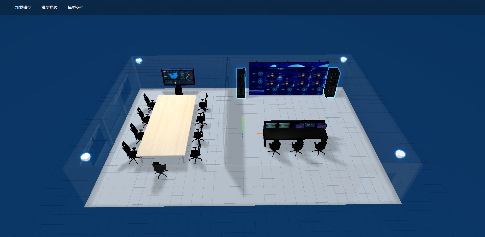
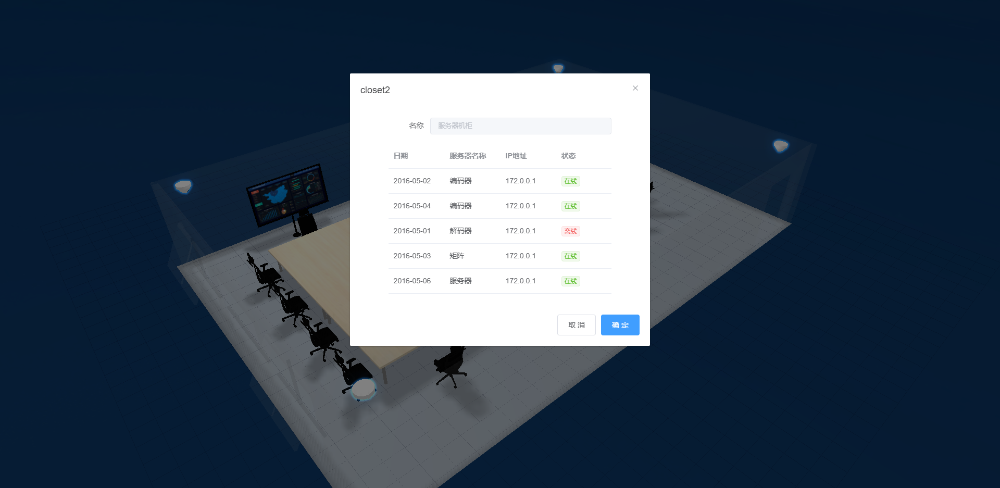

# 项目介绍
本项目是基于`vue cli3`的单页应用，通过在`Vue`项目中引入`Three.js`相关库实现了外部模型的导入，加载显示并进行控制和交互。其中在最后一个示例中，可以点击高亮的模型弹出绑定信息的对话框。



>上图中的摄像头和机柜可以点击，点击后会分别弹出相关的设备信息



## 项目运行步骤
1. 安装依赖
```
npm install
```

2. 运行
```
npm run serve
```
项目启动成功后，再在浏览器地址栏输入`http://localhost:8080` 即可访问项目。
